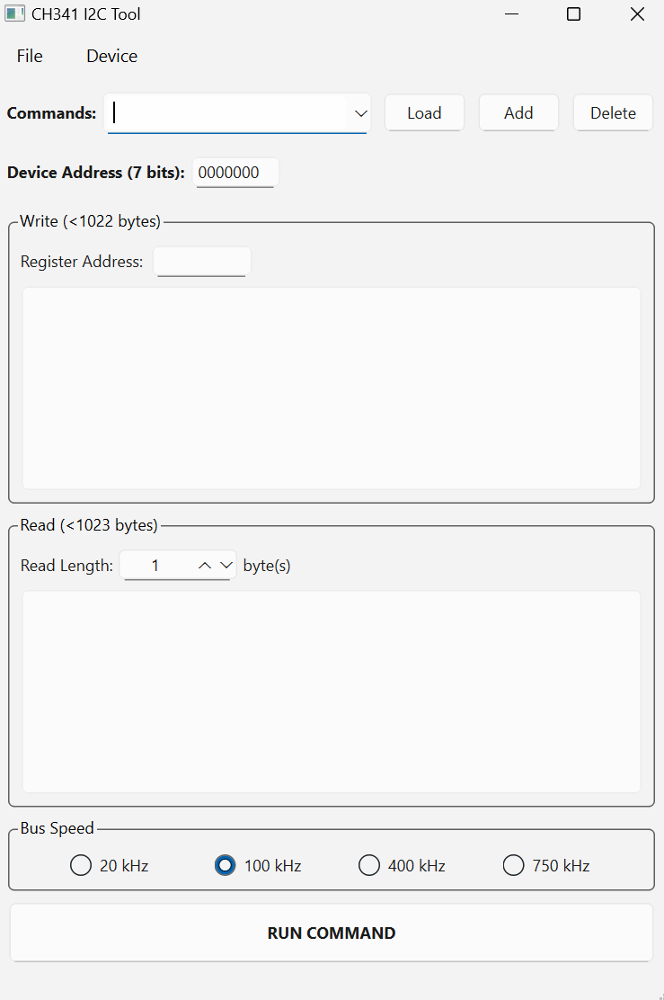

# CH341-I2C-Tool
A GUI tool that uses the [CH341 USB Bridge Controller](https://www.wch-ic.com/products/CH341.html) to read/write via the I2C protocol.

## Building the source
Download [CH341PAR.ZIP](https://www.wch-ic.com/downloads/CH341PAR_ZIP.html). Extract `\LIB\CH341\CH341DLL_EN.H` and `\LIB\CH341\amd64\CH341DLLA64.LIB` into the project root. This then builds like any Qt project (assuming MinGW 64-bit is the version installed and is added to your path). 

Run `qmake CH341_I2C_Tool.pro` to generate the makefile, then `mingw32-make` to compile the executable. Finally, use `windeployqt CH341_I2C_Tool.exe` to copy the necessary Qt libraries so the program can launch. 

## Usage
Install the driver first by downloading [CH341PAR.EXE](https://www.wch-ic.com/downloads/CH341PAR_EXE.html) and launching it.

### Connect Device
Unless there are multiple CH341 devices plugged in, the "Device Number" field can be left alone at 0 and "CONNECT" can be clicked to open the main window.

Once the main window is opened, device connection can be confirmed by clicking `Device > About Device`. If the driver version is a nonzero number, the CH341 device is connected.

If at any point the device is disconnected, click `Device > Reconnect CH341 Device` to return to the device  select window.

### Read/Write
Input should be entered in ***space separated, binary*** form. It is not required to fully type a byte, typing `1` instead of `00000001` is perfectly fine.

To read from or write to a register, make sure to provide the register address either in the corresponding field or as the first byte in the "Write" text box.

### Commands
Inputs can be saved by first providing a name in the "Commands" field, then clicking `Add`. If a command of the same name was already added, its saved input will be replaced. 

To load a desired command, select it from the drop-down menu and click `Load` to automatically fill in the saved input. Similarly, clicking `Delete` will remove the current command being selected.

To save the current list of commands to a CSV file, click `File > Save As` and choose an appropriate file location. Clicking `File > Open` and selecting a valid CSV file will load its commands back into the drop-down menu. Any changes to the commands list such as adding, modifying or deleting a command can be saved with `File > Save` as long as there's a file to save to.
## License
This project is licensed under the terms of the [GNU Lesser General Public License v3.0](https://www.gnu.org/licenses/lgpl-3.0.en.html). The LGPL v3.0 and GPL v3.0 licenses are also included in this repository respectively in files `COPYING.LESSER` and `COPYING`.
